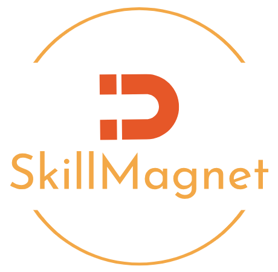

# Skill Magnet: Full Stack Service app

## Description

SkillMagnet is a job board to sell and hire services that one might need asistance or particular skills to complete. It is a web application designed to make it easier to find, contact, and pay for jobs such as babysitting, handyman work, etc. SkillMagnet is free to use and doesn't take a profit off of sold services, making it easier for members of the community to market themselves and support each other's businesses. 

In this project, every member of Quin-tech better learned how to implement MERN, React, GraphQl, Redux, and React frameworks.

## Installation

Repository URL: https://github.com/quin-tech/full-stack-service-app   
Deployed application: https://full-stack-service-app.onrender.com/ 

## Usage

This web application is ready-to-use. Just open the deployed application link provided above, and begin interacting with the website. Use the Navbar on the left to direct to different pages. If someone is interested in buying a service, just click on that serice then "Add to Cart". To interact with items in your cart, hit the cart icon in the top right corner.

## Credits

This web application was developed in collaboration with Madison Eckstrom, Tabbatha Pischke, Tony Magrady, Jack Weng and Solange Indaco.

To refactor this web application, we used the following tutorials and libraries:    
        - Redux: https://www.npmjs.com/package/redux  
        - Readt-redux: https://www.npmjs.com/package/react-redux   
        - Redux: https://redux.js.org/     
        - React: https://react.dev/learn  
        - Context: https://legacy.reactjs.org/docs/context.html      
        - Vite: https://vitejs.dev/     
        - Apollo: https://www.apollographql.com/docs/graphos/explorer/                  
        - GraphQL: https://graphql.org/learn/queries/                   
        - Authentication: https://www.apollographql.com/docs/react/networking/authentication/       
        - Render: https://coding-boot-camp.github.io/full-stack/mongodb/deploy-with-render-and-mongodb-atlas 
        - Logo: https://app.logo.com/
        - MUI: https://mui.com/material-ui/ 
                                                                           

## License

Licensed under the [MIT](LICENSE) license.

